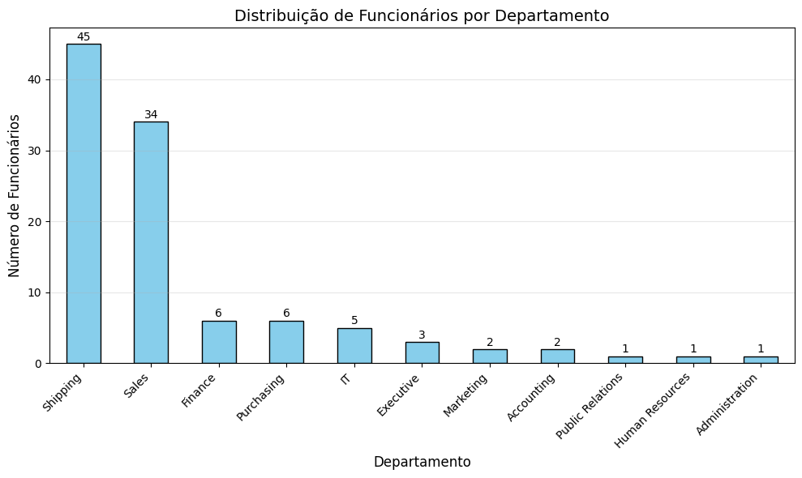
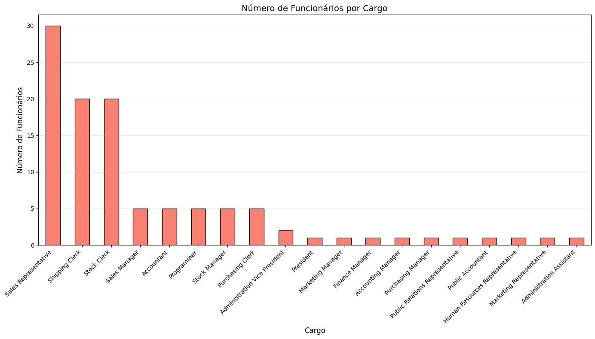
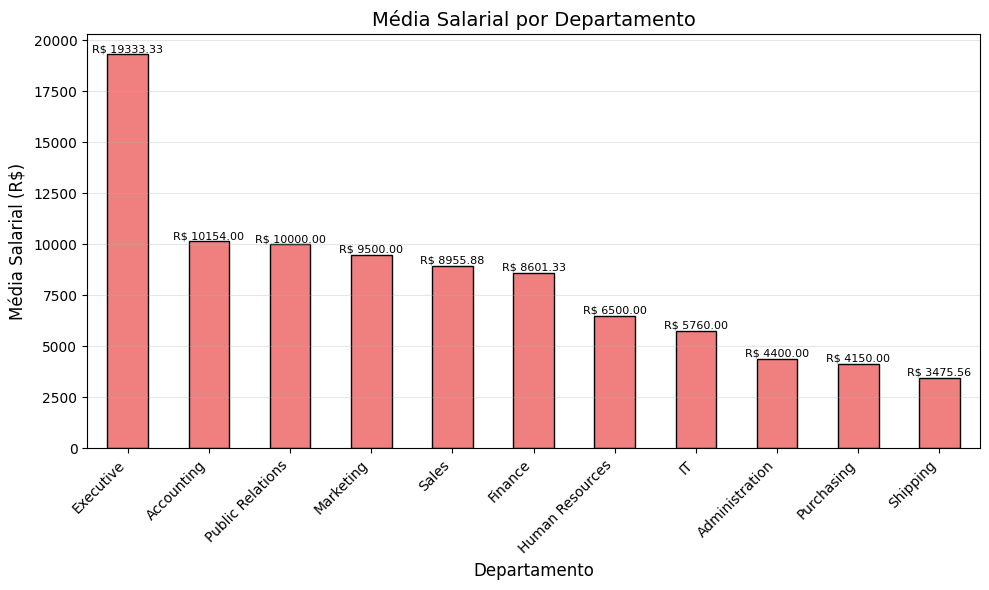

# Projeto_Final_Modulo_1_Aluno_Isaac_Trenard

# 🏢 Projeto RH - Análise de Salários e Distribuição Geográfica

**Aluno:** Isaac Trenard  
**Turma:** Visualização de Dados e Business Intelligence [T2]  
**Módulo:** 1 - Semana 13  

==================================================================

## 🎯 Objetivo do Projeto

Este projeto tem como objetivo aplicar e consolidar todos os conhecimentos adquiridos ao longo do curso **SC Tech — Visualização de Dados e Business Intelligence [T2]**, integrando as principais ferramentas utilizadas no dia a dia de um analista de dados: VS Code, Banco de Dados FreeSQL e linguagem Python.

A partir de uma base de dados de Recursos Humanos (RH), a análise busca responder a perguntas estratégicas sobre a estrutura salarial da empresa, explorando:

- A distribuição dos salários por departamento e cargo;
- A distribuição geográfica dos funcionários (cidade, estado ou país);
- Padrões de remuneração e a identificação de possíveis outliers.

O projeto simula uma demanda real da área de RH, onde o objetivo é transformar dados brutos em informações claras e úteis para a tomada de decisão, colocando em prática os conceitos e ferramentas desenvolvidos durante o curso.

---

## 📊 Tabelas Utilizadas

As seguintes tabelas do esquema **HR** do banco FreeSQL foram utilizadas:

| Tabela | Descrição |
|--------|-----------|
| `EMPLOYEES` | Dados dos funcionários (salário, cargo, departamento) |
| `DEPARTMENTS` | Informações sobre os departamentos |
| `JOBS` | Detalhes dos cargos (título, faixa salarial) |
| `LOCATIONS` | Localização dos departamentos |
| `COUNTRIES` | Nomes dos países |
| `REGIONS` | Nomes das regiões |

## 📝 Consultas SQL

### Query 1 - Salário por Departamento e Cargo
**Objetivo:** Analisar a distribuição de salários por departamento e cargo.

```sql
-- Query 1
SELECT
    e.EMPLOYEE_ID,
    e.FIRST_NAME,
    e.LAST_NAME,
    e.SALARY,
    d.DEPARTMENT_NAME,
    d.DEPARTMENT_ID,
    j.JOB_TITLE,
    j.JOB_ID
FROM HR.EMPLOYEES e
LEFT JOIN HR.DEPARTMENTS d ON e.DEPARTMENT_ID = d.DEPARTMENT_ID
LEFT JOIN HR.JOBS j ON e.JOB_ID = j.JOB_ID
WHERE e.SALARY IS NOT NULL
ORDER BY e.SALARY DESC

### Query 2 - Funcionários por Região (com localização)
**Objetivo:**: Analisar salários e distribuição geográfica dos funcionários.

sql
-- Query 2
SELECT
    e.EMPLOYEE_ID,
    e.FIRST_NAME,
    e.LAST_NAME,
    e.SALARY,
    d.DEPARTMENT_NAME,
    l.CITY,
    c.COUNTRY_NAME,
    r.REGION_NAME
FROM HR.EMPLOYEES e
LEFT JOIN HR.DEPARTMENTS d ON e.DEPARTMENT_ID = d.DEPARTMENT_ID
LEFT JOIN HR.LOCATIONS l ON d.LOCATION_ID = l.LOCATION_ID
LEFT JOIN HR.COUNTRIES c ON l.COUNTRY_ID = c.COUNTRY_ID
LEFT JOIN HR.REGIONS r ON c.REGION_ID = r.REGION_ID
WHERE e.SALARY IS NOT NULL
ORDER BY e.SALARY DESC;

## 🐍 Análise em Python

A análise foi realizada em dois notebooks: `analise_query1.ipynb` e `analise_query2.ipynb`.

### Principais etapas:
1. Importação das bibliotecas pandas, matplotlib e seaborn;
2. Carregamento dos CSVs exportados do FreeSQL;
3. Análise exploratória (estatísticas descritivas, agrupamentos);
4. Geração de gráficos para visualização dos padrões salariais.

### 📊 Visualizações AED da query 1

#### 1. Distribuição de funcionários por departamento

**Insight:** Os departamentos **Shipping** (45) e **Sales** (34) concentram a maior parte dos funcionários, enquanto cargos executivos e de relações públicas têm menos de 3 colaboradores.
=========================

#### 2. Número de funcionários por cargo

**Insight:** O cargo de **Sales Representative** é o mais comum (30 funcionários), seguido por **Shipping Clerk** (20) e **Stock Clerk** (20). Cargos de alta gestão como **President** e **Marketing Manager** têm apenas 1 funcionário cada.
=========================

#### 3. Média salarial por departamento

**Insight:** O departamento **Executive** tem a maior média salarial (R$ 19.333), enquanto **Shipping** tem a menor (R$ 3.475). A diferença entre eles é de mais de 5 vezes.
=========================

#### 4. Distribuição de salários por departamento

**Insight:** O boxplot mostra que os salários em **Executive** têm pouca variação (entre R$ 17.000 e R$ 24.000), enquanto departamentos como **Sales** e **Shipping** apresentam maior dispersão, indicando diferenças internas significativas.
=========================

#### 5. Distribuição de salários por cargo

**Insight:** Cargos como **President** e **Administration Vice President** têm salários concentrados no topo da escala, enquanto **Shipping Clerk** e **Stock Clerk** ocupam a base, com salários entre R$ 2.000 e R$ 4.000.

# EM CONSTRUÇÃO
