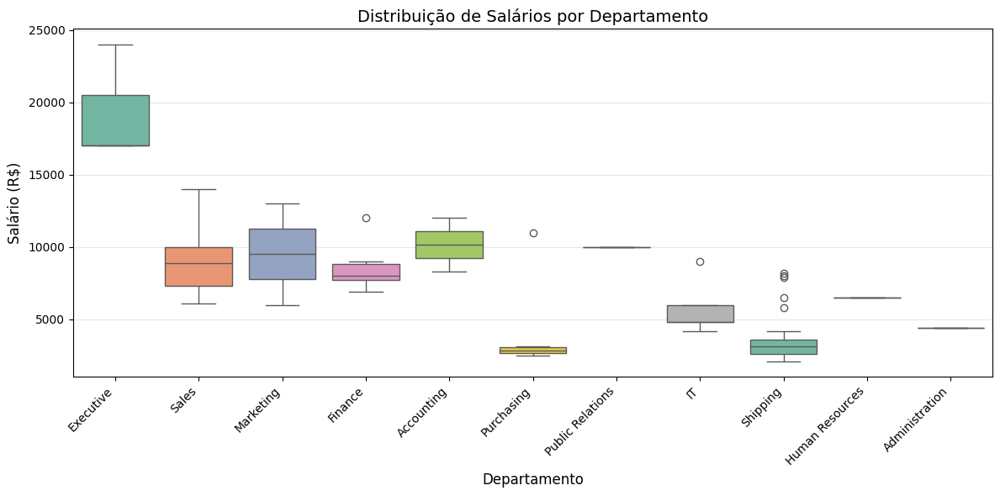
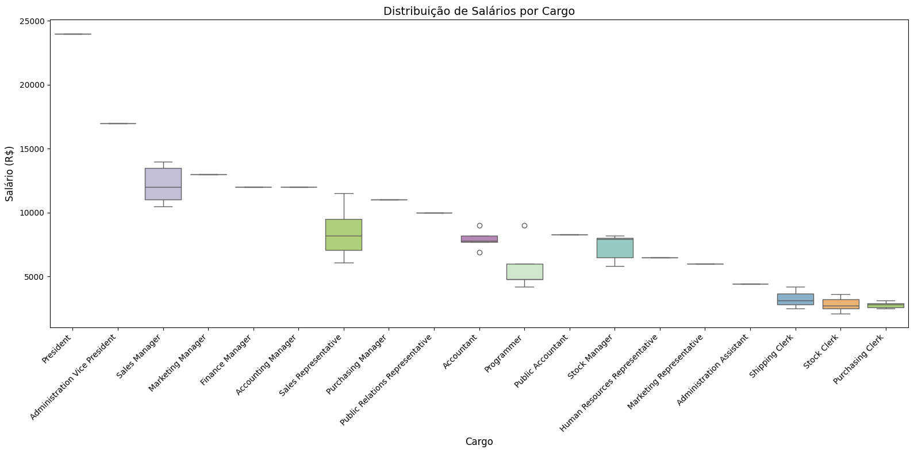
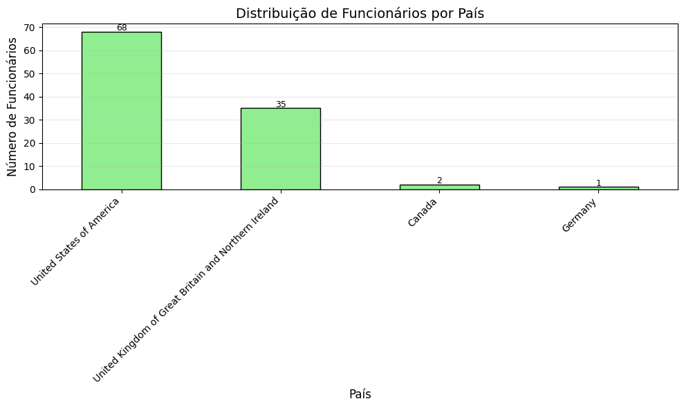
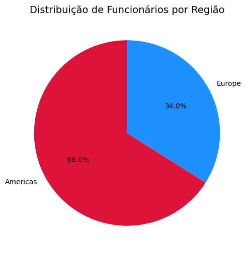
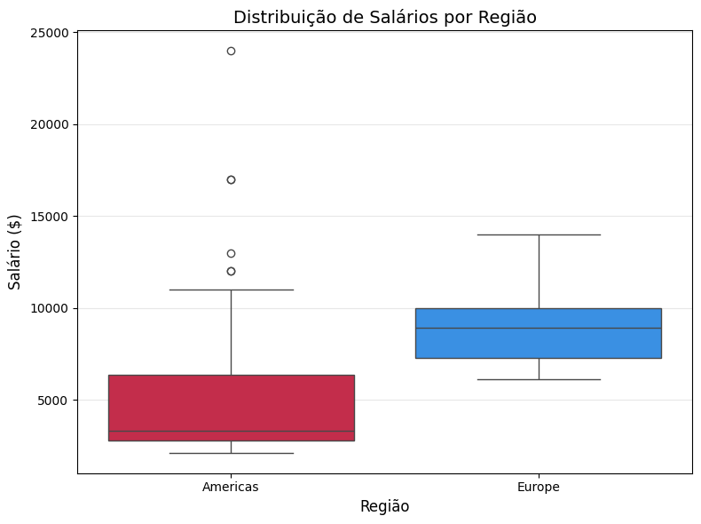
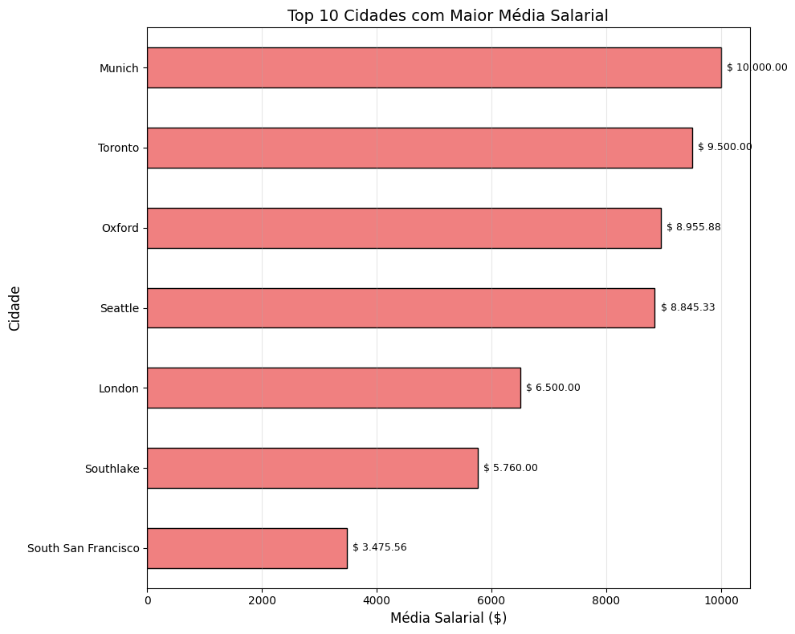

# 🏢 Projeto RH - Análise de Salários e Distribuição Geográfica

**Aluno:** Isaac Trenard
**Turma:** Visualização de Dados e Business Intelligence [T2]
**Módulo:** 1 - Semana 13

---

# 🎯 Objetivo do Projeto

Este projeto tem como objetivo aplicar e consolidar todos os conhecimentos adquiridos ao longo do curso **SC Tech — Visualização de Dados e Business Intelligence [T2]**, integrando as principais ferramentas utilizadas no dia a dia de um analista de dados: **VS Code**, **Banco de Dados FreeSQL** e **Python**.

A partir de uma base de dados de Recursos Humanos (RH), a análise busca responder a perguntas estratégicas sobre a estrutura salarial da empresa, explorando:

* A distribuição dos salários por departamento e cargo;
* A distribuição geográfica dos funcionários (cidade, estado ou país);
* Padrões de remuneração e a identificação de possíveis outliers.

O projeto simula uma demanda real da área de RH, onde o objetivo é transformar dados brutos em informações claras e úteis para a tomada de decisão, colocando em prática os conceitos e ferramentas desenvolvidos durante o curso.

---

# 📊 Tabelas Utilizadas

As seguintes tabelas do esquema **HR** do banco **FreeSQL** foram utilizadas:

| Tabela      | Descrição                                             |
| ----------- | ----------------------------------------------------- |
| EMPLOYEES   | Dados dos funcionários (salário, cargo, departamento) |
| DEPARTMENTS | Informações sobre os departamentos                    |
| JOBS        | Detalhes dos cargos (título, faixa salarial)          |
| LOCATIONS   | Localização dos departamentos                         |
| COUNTRIES   | Nomes dos países                                      |
| REGIONS     | Nomes das regiões                                     |

---

# 📝 Consultas SQL

## Query 1 - Salário por Departamento e Cargo

**Objetivo:** Analisar a distribuição de salários por departamento e cargo.

```sql
-- Query 1
SELECT
    e.EMPLOYEE_ID,
    e.FIRST_NAME,
    e.LAST_NAME,
    e.SALARY,
    d.DEPARTMENT_NAME,
    d.DEPARTMENT_ID,
    j.JOB_TITLE,
    j.JOB_ID
FROM HR.EMPLOYEES e
LEFT JOIN HR.DEPARTMENTS d ON e.DEPARTMENT_ID = d.DEPARTMENT_ID
LEFT JOIN HR.JOBS j ON e.JOB_ID = j.JOB_ID
WHERE e.SALARY IS NOT NULL
ORDER BY e.SALARY DESC;
```

---

## Query 2 - Funcionários sobre sua localização

**Objetivo:** Analisar salários e distribuição geográfica dos funcionários.

```sql
-- Query 2
SELECT
    e.EMPLOYEE_ID,
    e.FIRST_NAME,
    e.LAST_NAME,
    e.SALARY,
    d.DEPARTMENT_NAME,
    l.CITY,
    c.COUNTRY_NAME,
    r.REGION_NAME
FROM HR.EMPLOYEES e
LEFT JOIN HR.DEPARTMENTS d ON e.DEPARTMENT_ID = d.DEPARTMENT_ID
LEFT JOIN HR.LOCATIONS l ON d.LOCATION_ID = l.LOCATION_ID
LEFT JOIN HR.COUNTRIES c ON l.COUNTRY_ID = c.COUNTRY_ID
LEFT JOIN HR.REGIONS r ON c.REGION_ID = r.REGION_ID
WHERE e.SALARY IS NOT NULL
ORDER BY e.SALARY DESC;
```

---

# 🐍 Análise em Python

A análise foi realizada em dois notebooks:

* `analise_query1.ipynb`
* `analise_query2.ipynb`

### Principais etapas

* Importação das bibliotecas **pandas**, **matplotlib** e **seaborn**;
* Carregamento dos CSVs exportados do FreeSQL;
* Análise exploratória (estatísticas descritivas e agrupamentos);
* Geração de gráficos para visualização dos padrões salariais.

---

# 📊 Visualizações AED da Query 1

## 1. Distribuição de funcionários por departamento


**Insight:** Os departamentos Shipping (45) e Sales (34) concentram a maior parte dos funcionários, enquanto cargos executivos e de relações públicas têm menos de 3 colaboradores.

---

## 2. Número de funcionários por cargo


**Insight:** O cargo de Sales Representative é o mais comum (30 funcionários), seguido por Shipping Clerk (20) e Stock Clerk (20). Cargos de alta gestão como President e Marketing Manager têm apenas 1 funcionário cada.

---

## 3. Média salarial por departamento


**Insight:** O departamento **Executive** tem a maior média salarial (**$ 19.333,00**), enquanto **Shipping** apresenta a menor (**$ 3.475,00**). A diferença entre eles é superior a 5 vezes.

---

## 4. Distribuição de salários por departamento



**Insight:** O boxplot mostra que os salários em **Executive** têm pouca variação (entre **R$ 17.000,00** e **R$ 24.000,00**), enquanto departamentos como **Sales** e **Shipping** apresentam maior dispersão, indicando diferenças internas significativas.

---

## 5. Distribuição de salários por cargo



**Insight:** Cargos como **President** e **Administration Vice President** concentram salários no topo da escala, enquanto **Shipping Clerk** e **Stock Clerk** ocupam a base, com salários entre **R$ 2.000,00** e **R$ 4.000,00**.

---

# 📊 Visualizações AED da Query 2

## 1. Distribuição de funcionários por país



**Insight:** A maioria absoluta dos funcionários está nos **Estados Unidos (68)**, seguido pelo **Reino Unido (35)**. Canadá (**2**) e Alemanha (**1**) têm representação mínima, indicando forte concentração geográfica na América do Norte e Europa Ocidental.

---

## 2. Distribuição de funcionários por região



**Insight:** As **Américas** concentram **70 funcionários (65,4%)**, enquanto a **Europa** possui **36 (33,6%)**, reforçando a predominância norte-americana na estrutura da empresa.

---

## 3. Distribuição de salários por região



**Insight:** O boxplot revela que a **Europa** apresenta uma distribuição salarial mais homogênea e com valores mais elevados, com mediana próxima de **US$ 8.900**.

Já as **Américas** exibem maior variabilidade, com salários mais baixos (mediana em torno de **US$ 3.300**) e a presença de outliers na faixa superior (acima de **US$ 20.000**), indicando disparidades internas significativas.

---

## 4. Top 10 cidades com maior média salarial



**Insight:** **Munique** e **Toronto** lideram com as maiores médias salariais, embora contem com poucos funcionários.

**Oxford (Reino Unido)** destaca-se com média de **US$ 8.955,88** e **34 colaboradores**, consolidando-se como um polo de alta remuneração.

Em contraste, **South San Francisco** apresenta a menor média (**US$ 3.475,56**), apesar de ser a cidade com o maior número de colaboradores (**45**).

---

# 🎯 Conclusão Final

A análise integrada das duas queries permitiu traçar um panorama abrangente da estrutura salarial e da distribuição geográfica da empresa.

## Principais Descobertas

* **Concentração geográfica:** Forte presença nos **Estados Unidos (68)** e **Reino Unido (35)**, com participação marginal no **Canadá (2)** e **Alemanha (1)**.
* **Disparidade salarial regional:** A **Europa** apresenta salários mais elevados (média de **US$ 8.916,67**) em comparação às **Américas (US$ 5.191,66)**.
* **Hierarquia salarial:** O departamento **Executive** possui a maior média (**R$ 19.333,33**), enquanto **Shipping** apresenta a menor (**R$ 3.475,56**).
* **Desigualdade interna:** Departamentos como **Sales** e **Shipping** apresentam grande variação salarial.
* **Outliers relevantes:** Salários muito acima da média (como **US$ 24.000** de *Steven King* e **US$ 14.000** em *Sales*) distorcem as análises e devem ser tratados separadamente.

---

## Recomendações para a Gestão de RH

* Revisar política salarial nas Américas;
* Padronizar cargos e salários;
* Expandir presença geográfica;
* Monitorar outliers.

---

# 🚀 Como Executar o Projeto

## Pré-requisitos

* Python 3.8 ou superior;
* Jupyter Notebook ou VS Code;
* Acesso ao banco **FreeSQL**;
* Bibliotecas:

  * `pandas`
  * `matplotlib`
  * `seaborn`

## Passo a Passo

```bash
# Clone o repositório
git clone https://github.com/isaaclicCode/Projeto_Final_Modulo_1.git

# Entre na pasta
cd Projeto_Final_Modulo_1

# Instale as dependências
pip install pandas matplotlib seaborn

# Abra o Jupyter Notebook
jupyter notebook
```

Execute os notebooks na seguinte ordem:

1. `analise_query1.ipynb`
2. `analise_query2.ipynb`

Os gráficos serão salvos automaticamente nas pastas:

```text
Gráficos_query_1/
Gráficos_query_2/
```

---

# 📎 Links de Entrega

* **Repositório GitHub:** Projeto Final
* **Vídeo explicativo:** YouTube/Vimeo
* **Tarefa AVA:** Módulo 1 - Projeto Avaliativo (Semana 12)
* **Data de entrega:** 20/07/2026

---

# 👨‍💻 Autor

**Desenvolvido por:** Isaac Trenard

**Turma:** Visualização de Dados e Business Intelligence [T2]

**Curso:** SC Tech — Módulo 1 — Semana 13
